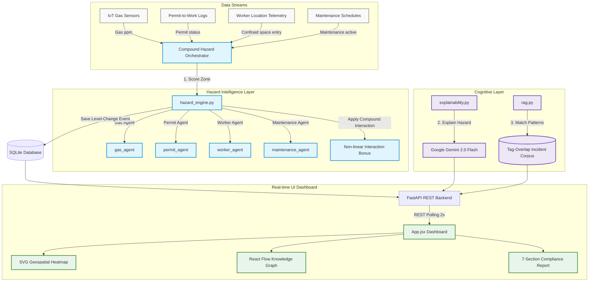

# FusionIQ: AI-Powered Industrial Safety Intelligence for Zero-Harm Operations

> **ET AI Hackathon 2026 Submission**  
> **Track:** Industrial Intelligence / Worker Safety / Geospatial Safety Analytics  
> **Problem Statement:** AI-Powered Industrial Safety Intelligence for Zero-Harm Operations

[](https://fusioniq-frontend.vercel.app/)
[](https://fusioniq-backend.onrender.com/docs)
[](#tech-stack)
[](#automated-testing)

---

## 🚨 The Context & Problem
India's heavy industrial sector pays a devastating human cost. According to **DGFASLI**, over **6,500 fatal workplace accidents** were recorded in FY2023 (excluding most mining and construction sectors). 

In January 2025, eight workers tragically died at the Visakhapatnam Steel Plant due to an explosion in a coke oven battery. The plant *had functioning safety systems* — gas detectors, permit-to-work controls, and SCADA. The investigation revealed that **warning signals from gas pressure sensors existed, but no intelligence layer connected those readings to operational decisions in time.**

This pattern — **data present, but unacted upon** — is systemic. A **FICCI survey in 2024** revealed that over **60% of large industrial facilities** rely on manual handoffs to coordinate safety tools. 

### The FusionIQ Solution
Traditional SCADA systems alarm only when individual sensors cross hardcoded limits. However, industrial disasters rarely result from a single failure; they are triggered by **compound risk factors** that are individually "safe" but collectively catastrophic:
- **Gas concentration** at 85 ppm (Safe on its own; alarm threshold is 100 ppm)
- **Active Hot-Work Permit** in the vicinity (Standard maintenance activity)
- **Confined-Space Entry** (No fast escape route for operators)
- **Active Maintenance Team** (Additional ignition and complexity risks)

Individually, these indicators trigger no alarms. **Together, they create a ticking time bomb.**

**FusionIQ** is a real-time safety intelligence platform that integrates disparate data streams into a **unified predictive hazard engine**. It evaluates the compound risk of the facility, explains the threat in natural language, matches it with historical incident records, and automates emergency protocols.

---

## 🛠️ System Architecture & Data Flow

FusionIQ uses a multi-agent orchestration architecture to ingest, analyze, correlate, and act upon concurrent safety signals:



---

## 💡 Core Innovation: The Compound Hazard Formula

The core innovation of [hazard_engine.py](backend/app/hazard_engine.py) is its ability to bypass isolated thresholds and compute non-linear risk interactions.

```python
# 1. Independent Signal Agents calculate partial risk scores
gas_score    = min(60, (gas_ppm / threshold) * 60)  # Capped: gas alone cannot cross "High" (60)
permit_score = 15.0 if hot_work_permit else 0.0
worker_score = 15.0 if confined_space_entry else 0.0
maint_score  = 10.0 if maintenance_active else 0.0

base_score = gas_score + permit_score + worker_score + maint_score

# 2. Non-linear Compound Interaction Bonus fires when:
#    Gas is elevated (>75% LEL) AND >=2 operational risk factors are co-occurring
active_risk_factors = sum([hot_work_permit, confined_space_entry, maintenance_active])

if (gas_ppm / threshold) > 0.75 and active_risk_factors >= 2:
    interaction_bonus = 15.0 * active_risk_factors
else:
    interaction_bonus = 0.0

# 3. Final Clamped Compound Score
final_score = min(100.0, base_score + interaction_bonus)
```

### Why this saves lives:
Under traditional SCADA systems, a gas reading of **91 ppm** (threshold 100 ppm) is flagged as nominal or slightly elevated. In FusionIQ, if that 91 ppm co-occurs with hot-work and a confined space entry, the orchestrator triggers the **Compound Interaction Bonus**:
* **Gas Agent Score:** `54.6`
* **Permit Agent Score:** `15.0`
* **Worker Agent Score:** `15.0`
* **Base Score:** `84.6`
* **Interaction Bonus:** `15.0 * 2 = 30.0` (Fired because gas ratio is $91\% > 75\%$ and active factors = 2)
* **Compound Score:** `100.0 (Critical)` (Clamped to 100)

**The 45.4-point delta is the compound intelligence signal** that prevents disasters before they happen.

---

## ⚡ Key Hackathon Deliverables & Features

### 1. Compound Risk Detection Engine (Multi-Agent System)
Implemented in [hazard_engine.py](backend/app/hazard_engine.py), it coordinates four specialized agents evaluating gas concentrations, active permit types, confined-space entry logs, and active maintenance workflows.

### 2. Live SVG Geospatial Safety Heatmap
Implemented in [HeatmapGrid.jsx](frontend/src/components/HeatmapGrid.jsx), it maps risk zones dynamically over the plant layout in real-time. Opacity transitions smoothly, and zones pulse red/orange during "High" and "Critical" states, providing immediate, high-fidelity situational awareness.

### 3. Incident Pattern Intelligence (Lightweight RAG)
Implemented in [rag.py](backend/app/rag.py), it extracts active hazard tags from current signals and performs a tag-overlap comparison against a **15-entry historical incident corpus** (incorporating DGFASLI statistics and real-world failure patterns). It returns the highest matching historical incident with root cause, similarity percentage, and outcome, showing safety officers where this exact combination of factors led to fatalities in the past.

### 4. Digital Permit Intelligence Agent
Flags simultaneous operations (SIMOPs) conflicts. For example, it highlights when a hot-work permit (open flame) is active in proximity to a zone with elevated gas concentration, providing immediate visual and text alerts.

### 5. Emergency Response Orchestrator (Automated Audits)
Generates a structured, 7-section regulatory-style incident report upon level changes (available for download as `.txt` via the UI). It auto-populates compliance guidelines based on:
- **The Factories Act, 1948** (Section 36: Precautions against dangerous fumes; Section 36A: Portable electric lights)
- **OISD Standard 105** (Permits to Work System)
- **OISD Standard 116 & 117** (Fire Protection & Prevention)
- **DGMS Circular 04/2023** (Confined Space Safety)

### 6. Explainable AI (XAI)
Powered by **Google Gemini 2.0 Flash** (in [explainability.py]( backend/app/explainability.py)). When hazard levels escalate, Gemini evaluates the active sensor variables and returns a natural-language root cause, an AI confidence rating, and exactly three prioritized emergency steps. It features:
* **Asynchronous Threading & Timeouts:** Fast API thread is never blocked; if the network call takes $>8$ seconds, it gracefully reverts to a deterministic local fallback.
* **In-memory Caching:** Explanations are cached per event ID to minimize API usage during rapid frontend polling (every 2 seconds).

---

## 📽️ Live Demo Scenario

The backend includes a real-time data simulator (`backend/app/simulator.py`) running a looped 3-minute scenario from `data/scenario.json`. The timeline illustrates the progression of an industrial emergency in **Zone Alpha (Compressor Hall)**:

| Scenario Time | Real Time | Gas (ppm) | Hot-Work | Confined Space | Maintenance | Score | Hazard Level | State / Dashboard Reaction |
|---|---|---|---|---|---|---|---|---|
| **0:00** | ~0s | 40 ppm | — | — | — | **8.0** | **Safe** | Normal plant operations. Zone Alpha is Green. |
| **0:50** | ~25s | 82 ppm | — | — | — | **22.0** | **Safe** | Gas rising. SVG Heatmap grid changes opacity. |
| **1:20** | ~40s | 85 ppm | ✓ | — | — | **41.0** | **Elevated** | Hot-work permit issued. Permit panel flags warnings. |
| **1:50** | ~55s | 88 ppm | ✓ | ✓ | — | **68.0** | **High** | Confined entry. React Flow graph links worker node. |
| **2:20** | ~70s | 91 ppm | ✓ | ✓ | ✓ | **100.0**| **Critical** | **Compound bonus fires.** Gemini explains root cause. |
| **2:40** | ~90s | Reset | — | — | — | **8.0** | **Safe** | Scenario resets back to nominal state. |

---

## 💻 Tech Stack

| Component | Technology | Purpose |
|---|---|---|
| **Backend Framework** | FastAPI (Python 3.11+) | Asynchronous REST APIs, automatic Swagger documentation at `/docs` |
| **Database** | SQLite + SQLAlchemy ORM | Audit log of hazard events, zone configurations, and workers |
| **Validation** | Pydantic v2 | Strict request and response schemas |
| **AI Explainability** | Google Gemini 2.0 Flash API | Natural-language explanation of compound risks |
| **Frontend UI** | React 18 + Vite | Single-page application, 2s polling dashboard |
| **Styling** | Tailwind CSS | Sleek dark mode design system |
| **Graph Visualization** | React Flow | Dynamic knowledge graph of zone-risk relationships |
| **RAG System** | Tag-Overlap matching | Explanable matching against 15 historical incidents |
| **Testing** | pytest | 21 unit tests validating the scoring and compound logic |

---

## 📂 Repository Structure

```
FusionIQ/
├── backend/
│   ├── app/
│   │   ├── main.py             # FastAPI App & routing (10 endpoints)
│   │   ├── database.py         # SQLite connection & SQLAlchemy schemas (6 tables)
│   │   ├── models.py           # Pydantic v2 schemas
│   │   ├── simulator.py        # Scenario timeline controller + interpolation
│   │   ├── hazard_engine.py    # Scoring Engine (4 agents + Orchestrator)
│   │   ├── explainability.py   # Gemini API integration + daemon timeouts + fallback
│   │   ├── rag.py              # Lightweight incident matcher
│   │   └── report_generator.py # Automated regulatory compliance formatter
│   ├── tests/
│   │   └── test_hazard_engine.py  # 21 pytest unit tests
│   └── requirements.txt
├── frontend/
│   └── src/
│       ├── App.jsx             # React dashboard & simulation control panel
│       ├── index.css           # Vanilla CSS + Tailwind integration
│       └── components/
│           ├── HeatmapGrid.jsx # Interactive SVG Geospatial Heatmap
│           └── KnowledgeGraph.jsx # Live React Flow Knowledge Graph
├── data/
│   ├── scenario.json           # Locked demo scenario timeline
│   └── incidents.json          # 15-entry historical incident RAG corpus
├── .env                        # GEMINI_API_KEY (git-ignored)
└── CHANGELOG.md                # Day-by-day development logs
```

---

## 🚀 How to Run Locally

### Prerequisites
* **Python 3.11+**
* **Node.js 18+**
* **Gemini API Key** (optional - fallback mode handles API key absence gracefully)

### 1. Clone & Environment Configuration
```bash
git clone <repository-url>
cd FusionIQ
```
Create a `.env` file in the root directory:
```env
GEMINI_API_KEY=your_google_gemini_api_key_here
```

### 2. Start Backend
In a new terminal window:
```powershell
cd backend
pip install -r requirements.txt
uvicorn app.main:app --reload
```
Verify the backend is running by opening the interactive documentation at: **http://localhost:8000/docs**.

### 3. Start Frontend
In a separate terminal window:
```powershell
cd frontend
npm install
npm run dev
```
Open **http://localhost:5173** to view the live dashboard. 

### 4. Run Automated Tests
Validate the compound hazard score calculations:
```powershell
cd backend
pytest tests/ -v
```
*Expected output:* `21 passed in <1.0s`

---

## 📡 API Endpoints

The FastAPI backend exposes 10 REST endpoints:

| Method | Path | Description |
|---|---|---|
| `GET` | `/health` | Liveness check |
| `GET` | `/docs` | Swagger UI documentation |
| `GET` | `/plant-state` | Fetch interpolated sensor telemetry for all 3 zones |
| `POST` | `/simulator/reset` | Restart the scenario clock to t=0 |
| `POST` | `/simulator/start` | Resume the scenario simulation |
| `POST` | `/simulator/pause` | Pause the scenario simulation |
| `GET` | `/hazard-score` | Fetch compound score and agent breakdown for all zones |
| `GET` | `/knowledge-graph/{zone_id}`| React Flow nodes and edges based on active zone signals |
| `GET` | `/hazard-explanation` | Cached Gemini explanation for the current active risk state |
| `GET` | `/incident-report` | Retrieve the 7-section compliance report (text) |

---

## 📈 Scalability Roadmap (Moving Beyond the Prototype)

FusionIQ was architected with production-grade scaling in mind:
1. **IoT Ingestion:** Transition from HTTP polling to an **MQTT / Kafka** messaging broker to handle tens of thousands of high-frequency sensor readings per second.
2. **Computer Vision (CCTV) Integration:** Deploy a Computer Vision Agent to feed real-time worker count and PPE (hard-hat, safety harness) compliance directly into the orchestrator.
3. **Enterprise RAG (Vector Database):** Replace the static `incidents.json` tag-overlap algorithm with a **ChromaDB / PGVector** database containing thousands of OISD regulations, Factory Act clauses, and historical incident PDFs, queried using sentence embeddings.
4. **Edge Deployment:** Run the core [hazard_engine.py]( backend/app/hazard_engine.py) on edge devices (e.g., AWS IoT Greengrass) to guarantee zero-latency execution even during plant network outages.

---

*FusionIQ · ET AI Hackathon 2026 Submission*